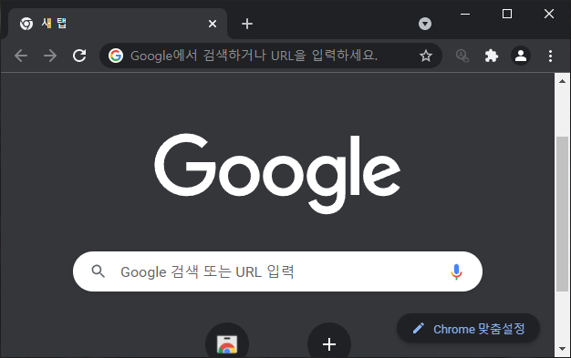
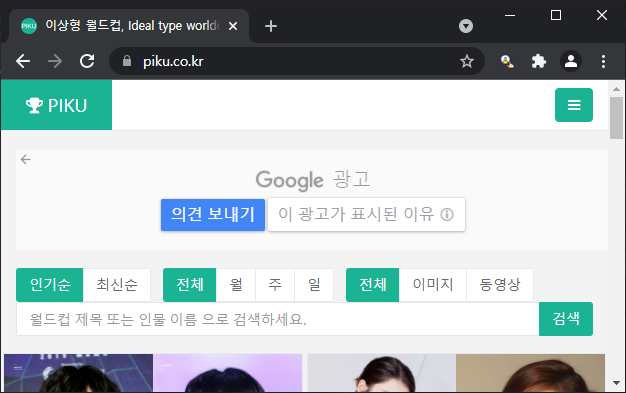
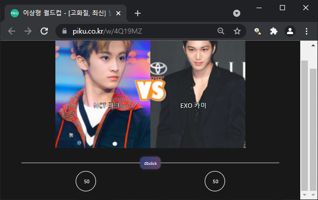

# 월드컵 랜덤 뽑기 프로그램 RANDCUP

## Feature

- [x] 슬라이더를 이용해서 각 항목이 선택될 확률을 조정할 수 있습니다.
  - You can use the slider to adjust the probability that each item will be selected.

## Usage

- 더블 클릭하면 지정된 확률로 랜덤하게 항목이 선택됩니다.
  - When you double-click a slider (or indicator), random item will be selected with a specified probability.
- 클릭이나 드래그로 확률을 조정할 수 있습니다.
  - You can adjust the probability by clicking or dragging.
- 인디케이터가 왼쪽으로 갈수록 왼쪽 항목이 선택될 확률이 높아집니다.
  - The more the indicator goes to the left, the higher the probability that the left item will be selected.
- 인디케이터가 오른쪽으로 갈수록 오른쪽 항목이 선택될 확률이 높아집니다.
  - The more the indicator goes to the right, the higher the probability that the right item will be selected.

## Screenshots

|             inactive(icon)              |             inactive(icon)              |
| :-------------------------------------: | :-------------------------------------: |
|  |  |

|            active(icon)             |             example              |
| :---------------------------------: | :------------------------------: |
|  |  |

|             example             |             example              |
| :-----------------------------: | :------------------------------: |
|  |  |

## License

Copyright (c) 2021 junhyeog. All rights reserved.

Licensed under the [MIT](LICENSE) license.
